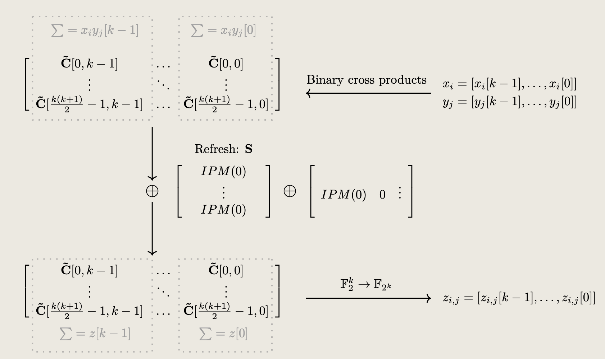

# 项目简介

本项目旨在复现论文《Bit t-SNI Secure Multiplication Gadget for Inner Product Masking》中提出的IPMGadget实现。通过使用Bit t-SNI的乘法器，我们以Python实现了论文中的伪代码和实现细节，旨在为研究人员和开发者提供一个参考实现。

## Bit t-SNI Secure Multiplication Gadget for Inner Product Masking

我们主要复现了此论文中的IPMGadget的实现，使用了Bit t-SNI的乘法器。我们在此处用python复现了伪代码和实现细节。

# REFERENCE
Gaspoz, J. and Dhooghe, S. 2024. Bit t-SNI Secure Multiplication Gadget for Inner Product Masking. IACR Transactions on Cryptographic Hardware and Embedded Systems. 2025, 1 (Dec. 2024), 104–127. DOI:https://doi.org/10.46586/tches.v2025.i1.104-127.